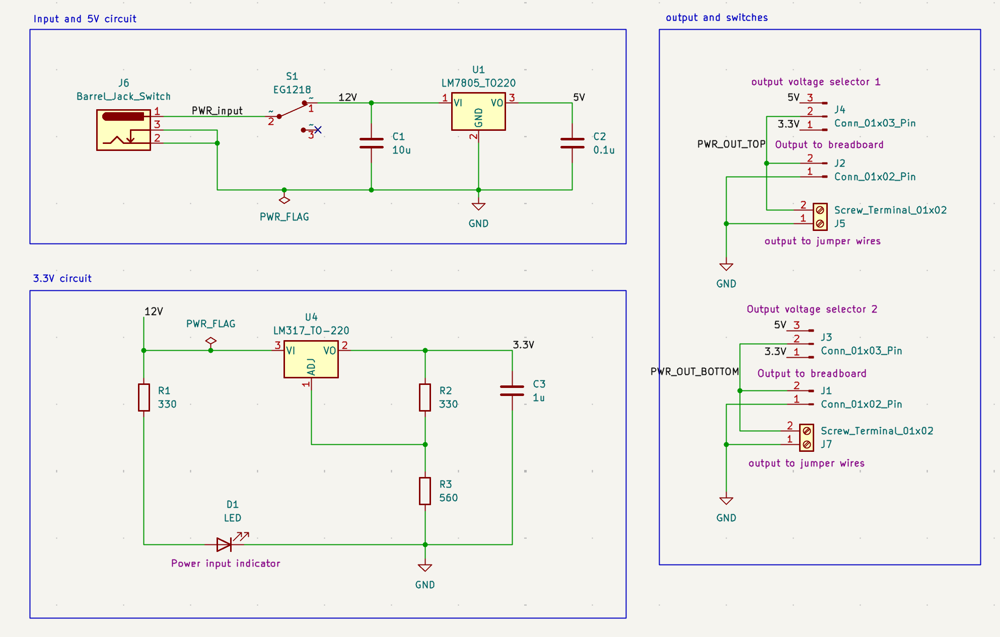
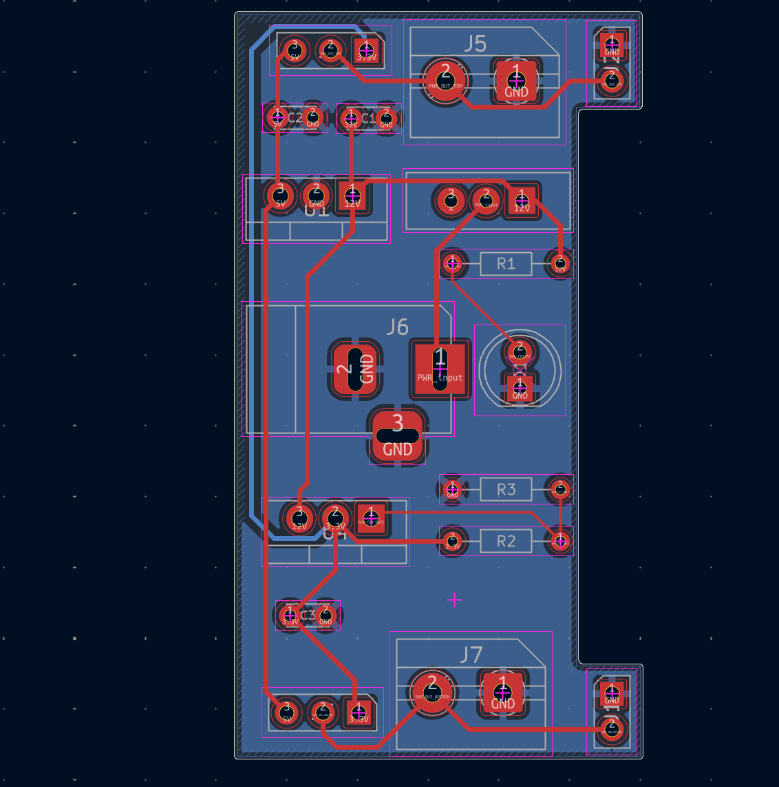
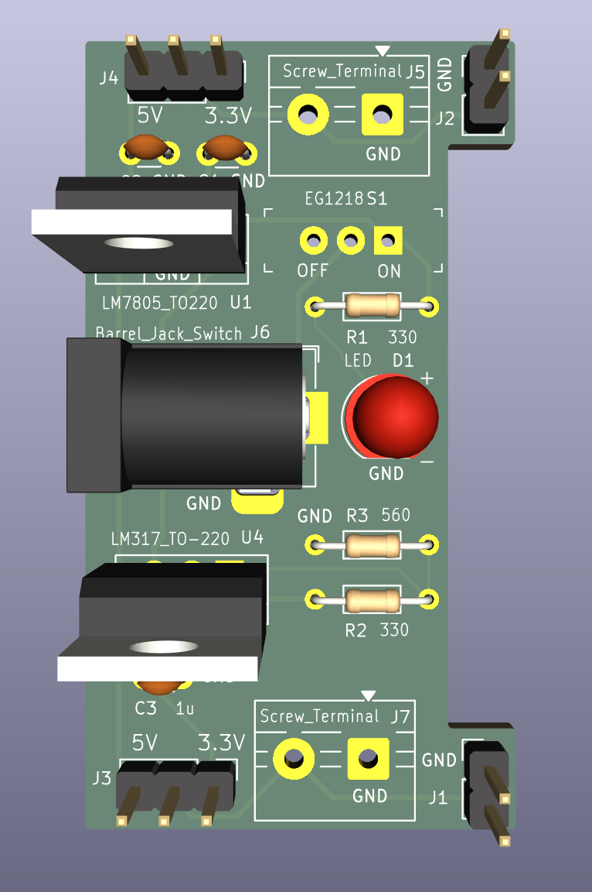
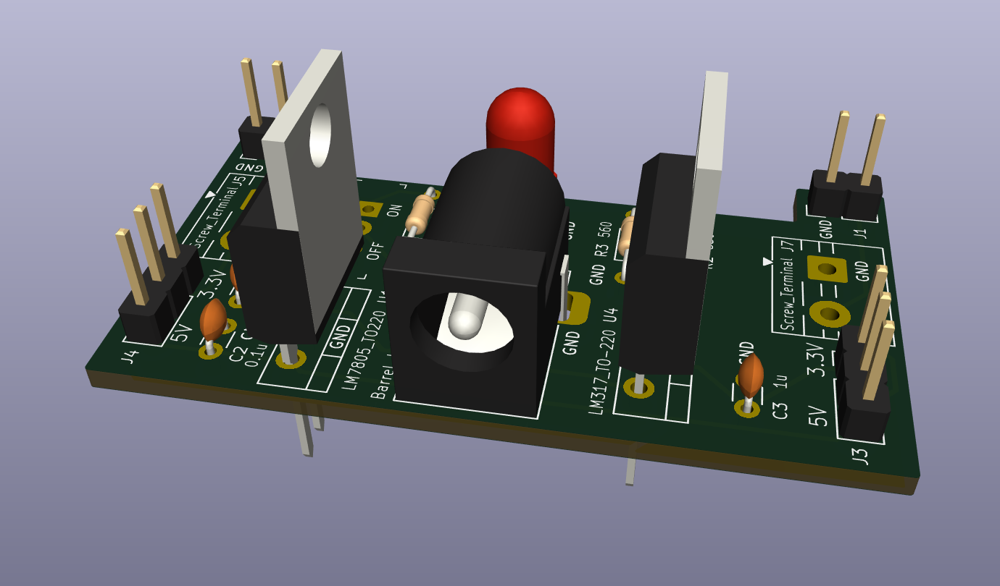
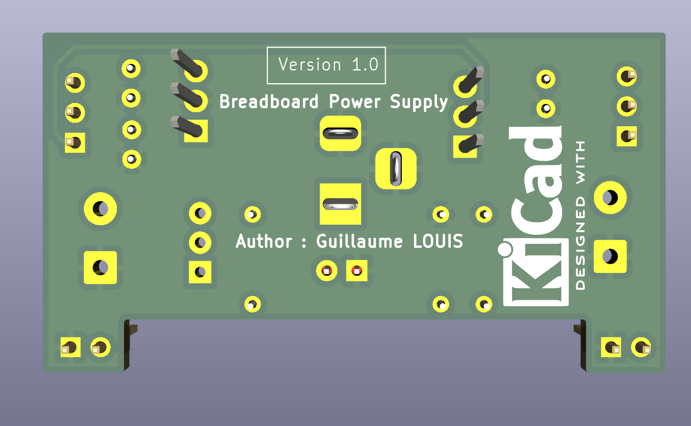

⚡ Breadboard Power Supply

Projet de conception électronique réalisé sous KiCad dans le cadre d'une formation en ligne. Cette alimentation réglable est conçue pour fournir 3.3V et 5V à des prototypes sur plaque d'essai (breadboard), avec deux sorties de tension sélectionnables.

💡 Description du projet

Ce projet permet de convertir une tension d'entrée (12V DC via jack) en deux rails de tension stables et protégés, indispensables pour le développement de systèmes embarqués.

Caractéristiques principales :
- Entrée : Connecteur Jack DC pour alimentation secteur externe (12V).
- Régulation 5V : Basée sur le régulateur linéaire LM7805 pour une tension fixe stable.
- Régulation 3.3V : Basée sur le régulateur ajustable LM317 pour une tension précise.
 - Flexibilité : Sélecteurs de tension pour chaque rail de sortie, permettant de choisir entre 5V et 3.3V indépendamment.
- Indicateur : LED de contrôle pour visualiser immédiatement la présence d'alimentation.

🛠️ Architecture électronique
La conception a été pensée pour la simplicité et la robustesse :
- Filtrage : Condensateurs de découplage (C1, C2, C3) placés pour stabiliser les sorties et réduire le bruit des régulateurs.
- Protection : Utilisation de régulateurs linéaires standards robustes pour un prototypage sans risque.
- Ergonomie : Sorties organisées pour une connexion directe aux rails d'alimentation d'une breadboard via des connecteurs header ou borniers à vis.

📸 Aperçu du projet

Schéma électronique : 

Routage PCB : 

Conception du PCB optimisée pour le passage de courant : pistes larges pour l'alimentation et plan de masse pour la stabilité thermique.

Modèle 3D : 

